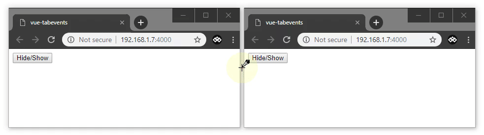

# vue-tabevents

[](https://www.npmjs.com/package/vue-tabevents)
[](https://github.com/almoullim/vue-tabevents/releases)
[](https://github.com/almoullim/vue-tabevents/blob/master/LICENSE)
[](https://www.jsdelivr.com/package/npm/vue-tabevents)
[](https://travis-ci.org/Almoullim/vue-tabevents)

Easy communication between tabs for Vue 2.x



## Getting Started

### Installing

Install with npm:

```bash
npm install --save vue-tabevents
```

import into project:

```js
import Vue from 'vue';
import vueTabevents from 'vue-tabevents';

Vue.use(vueTabevents);
```

## Usage

To an emit event to other tabs

```
this.$tabEvent.emit('eventName');

const data = {
	name: 'Ali'
	phone: 123
}

this.$tabEvent.emit('eventName', data);
```

To listen for events emitted by other types

```
this.$tabEvent.on('eventName', callback);

this.$tabEvent.on('eventName', (data) => console.log(data));
```

To stop listening to an event

```
this.$tabEvent.off('eventName');
```

## Authors

-   **Ali Almoullim** - [almoullim](https://github.com/almoullim)

## License

This project is licensed under the MIT License - see the [LICENSE.md](LICENSE) file for details
